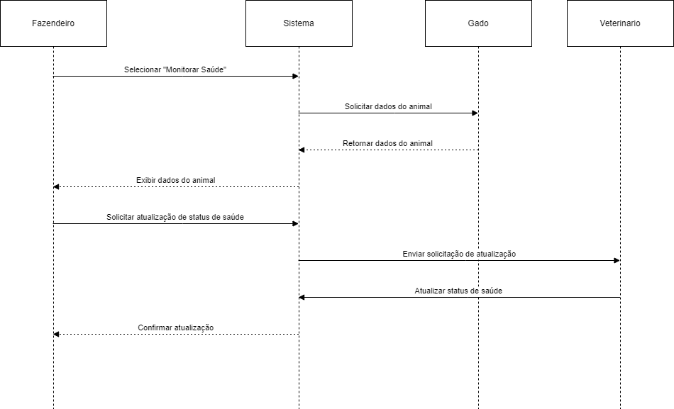
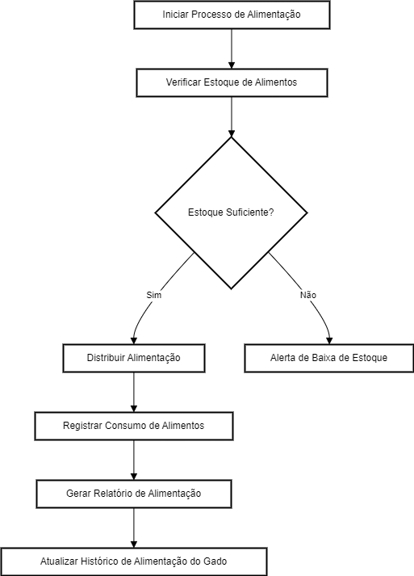
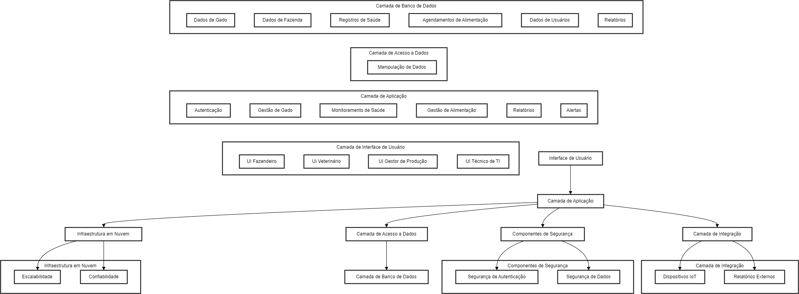
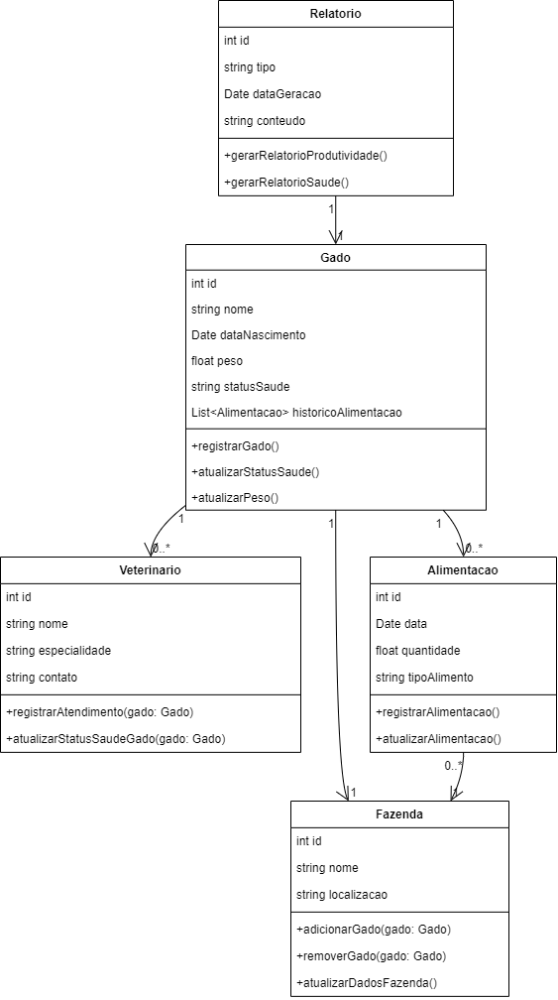
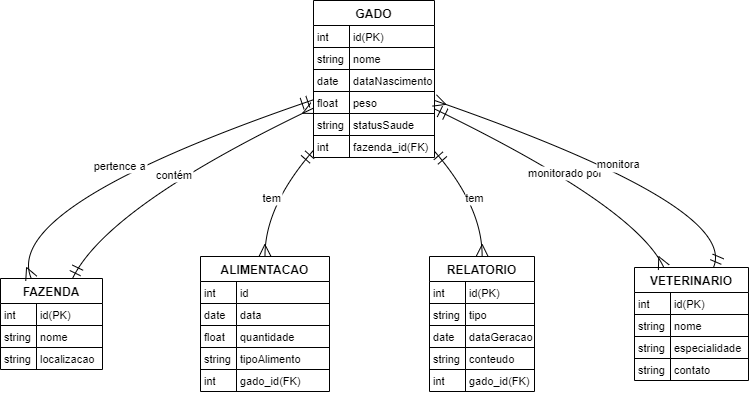

# Execução

> A fase de execução na gerência de projetos é o momento em que as atividades planejadas são realizadas. 
> Durante essa etapa, os membros da equipe executam suas tarefas de acordo com o cronograma estabelecido, os recursos são alocados conforme as necessidades e as comunicações são fundamentais para garantir que todos estejam alinhados com os objetivos. 
> O gerente de projeto atua na coordenação das atividades, resolução de problemas e na gestão de mudanças inesperadas. 
> Além disso, o monitoramento constante é essencial para garantir que o projeto esteja avançando conforme o planejado, e ajustes são feitos conforme necessário. 
> A fase de execução é o momento em que o trabalho tangível é realizado, e a eficácia nessa etapa contribui diretamente para o sucesso geral do projeto.

```diff
- Esta seção irá simular a execução do projeto. 
- Devido às características da disciplina, não será possível implementar o software (tempo insuficiente).
- Com isso, apenas simularemos a construção do sistema nesta etapa.
- Para isso, serão criados protótipos navegáveis, representando aquilo que seria desenvolvido em termos de interface.
- Diagramas arquiteturais, de banco de dados e de classe representarão a modelagem e implementação do código-fonte.
```

# Estrutura do Documento

- [Fase de Execução](#execução)
- [Interfaces do Sistema](#interfaces-do-sistema)
- [Modelagem da Solução](#modelagem-da-solução)
  - [Arquitetura da Solução](#arquitetura-da-solução)
  - [Diagrama de Classes](#diagrama-de-classes)
  - [Persistência dos Dados](#persistência-dos-dados)


# Interfaces do Sistema

......  INCLUA AQUI O DIAGRAMA COM O FLUXO DO USUÁRIO NA APLICAÇÃO ......

> Os protótipos navegáveis oferecem uma representação interativa das interfaces e funcionalidades do sistema antes da implementação final. 
> Esses protótipos permitem que os usuários experimentem a navegação real entre telas e interajam com elementos de interface, proporcionando uma visão prática do design proposto. 
> Ao criar protótipos navegáveis, os desenvolvedores podem validar conceitos, testar a usabilidade e obter feedback de stakeholders e usuários finais. 
> Essa abordagem contribui para a detecção precoce de possíveis problemas de usabilidade, refinando o design e economizando tempo e recursos durante o ciclo de desenvolvimento. 
>
> **Links Úteis**:
> - [User Flow: O Quê É e Como Fazer?](https://medium.com/7bits/fluxo-de-usu%C3%A1rio-user-flow-o-que-%C3%A9-como-fazer-79d965872534)
> - [User Flow vs Site Maps](http://designr.com.br/sitemap-e-user-flow-quais-as-diferencas-e-quando-usar-cada-um/)
> - [Top 25 User Flow Tools & Templates for Smooth](https://www.mockplus.com/blog/post/user-flow-tools)
>
> **Exemplo**:
> 
> 

# Modelagem da Solução

**Diagrama de Sequência**
O diagrama de sequência ilustra o fluxo de mensagens e interações entre os objetos do sistema ao longo do tempo para um processo específico, neste caso, o monitoramento da saúde do gado. Ele mostra como o Fazendeiro inicia o processo acessando o sistema para monitorar a saúde de um animal, como o sistema solicita e recebe os dados do animal da classe Gado, e como o Veterinário pode atualizar o status de saúde do animal. Este diagrama é crucial para compreender a lógica de execução do sistema, a sequência de operações e a comunicação entre diferentes componentes, ajudando a identificar possíveis problemas e otimizações no fluxo de trabalho.



**Diagrama de Atividades**
O diagrama de atividades descreve o fluxo de atividades e decisões em um processo específico, neste caso, o gerenciamento da alimentação do gado. Ele detalha as etapas desde o início do processo de alimentação, a verificação do estoque de alimentos, a distribuição da alimentação aos animais, o registro do consumo de alimentos, a geração de relatórios de alimentação e a atualização do histórico de alimentação do gado. Este diagrama é importante para visualizar o fluxo de trabalho, identificar pontos críticos, melhorar a eficiência dos processos e garantir que todas as atividades necessárias sejam executadas corretamente.



## Arquitetura da solução

A arquitetura de software define a organização de um sistema, estabelecendo seus componentes e suas relações. Ela orienta as decisões de desenvolvimento, influenciando desempenho, escalabilidade, segurança e manutenibilidade. Uma arquitetura bem projetada promove a modularidade, facilitando a evolução e manutenção do sistema.

**Justificativa da Arquitetura**
-Desempenho: Camadas separadas permitem otimização individual de cada componente.
-Escalabilidade: A infraestrutura em nuvem suporta crescimento conforme necessário.
-Segurança: Componentes dedicados à segurança protegem dados e usuários.
-Manutenibilidade: A modularidade facilita a manutenção e evolução do sistema.
-Colaboração: Arquitetura clara melhora a comunicação entre a equipe de desenvolvimento.

Essa arquitetura foi escolhida para atender aos objetivos do sistema, considerando o número esperado de usuários, o tamanho da aplicação, a previsão


> 
> 


## Diagrama de Classes

O diagrama de classes fornece uma visão detalhada da estrutura estática do sistema Boi Control, destacando as principais classes, seus atributos, métodos e os relacionamentos entre elas. As classes principais incluem Gado, Fazenda, Veterinario, Relatorio e Alimentacao. A classe Gado, por exemplo, contém atributos como id, nome, data de nascimento, peso e status de saúde, além de métodos para registrar, atualizar o status de saúde e o peso do gado. A classe Fazenda gerencia os dados da fazenda e a associação dos animais. Este diagrama é fundamental para a definição clara da modelagem de dados e para garantir que todas as entidades do sistema estejam bem definidas e integradas.

> O diagrama de classes fornece uma representação visual das estruturas e relações entre as classes em um sistema orientado a objetos. 
> O diagrama serve como uma documentação visual eficaz, facilitando a compreensão, manutenção e contínua do software.
>
> **Diagrama de Classes:**
> Desenvolva um diagrama de classes para o sistema proposto.
> Caso a solução fique muito grande, divida o diagrama por módulos ou serviços.
> Explique de forma concisa o diagrama, para que seja possível entender a solução proposta.
>
> **Diagrama de Classes**:
> 


## Persistência dos Dados

**Explicação do Diagrama**
-GADO: Representa os animais da fazenda. Contém atributos como id (PK), nome, dataNascimento, peso, statusSaude e fazenda_id (FK).
-FAZENDA: Representa as fazendas. Contém atributos como id (PK), nome e localizacao.
-VETERINARIO: Representa os veterinários. Contém atributos como id (PK), nome, especialidade e contato.
-ALIMENTACAO: Representa os registros de alimentação dos animais. Contém atributos como id (PK), data, quantidade, tipoAlimento e gado_id (FK).
-RELATORIO: Representa os relatórios gerados. Contém atributos como id (PK), tipo, dataGeracao, conteudo e gado_id (FK).
**Conexões**
-GADO -> FAZENDA: Cada animal pertence a uma fazenda (fazenda_id).
-GADO -> ALIMENTACAO: Cada animal pode ter múltiplos registros de alimentação (gado_id).
-GADO -> RELATORIO: Cada animal pode ter múltiplos relatórios (gado_id).
-FAZENDA -> GADO: Cada fazenda contém múltiplos animais.
-VETERINARIO -> GADO: Cada veterinário pode monitorar múltiplos animais (veterinario_id).
> **Diagrama de Banco de Dados**:
> 


